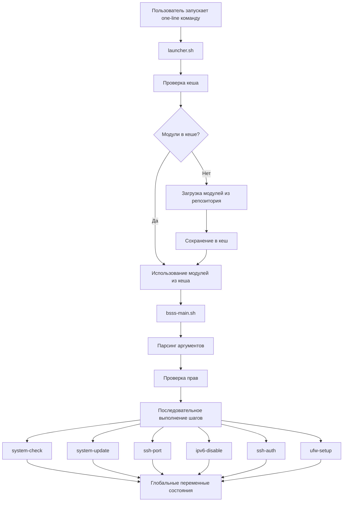
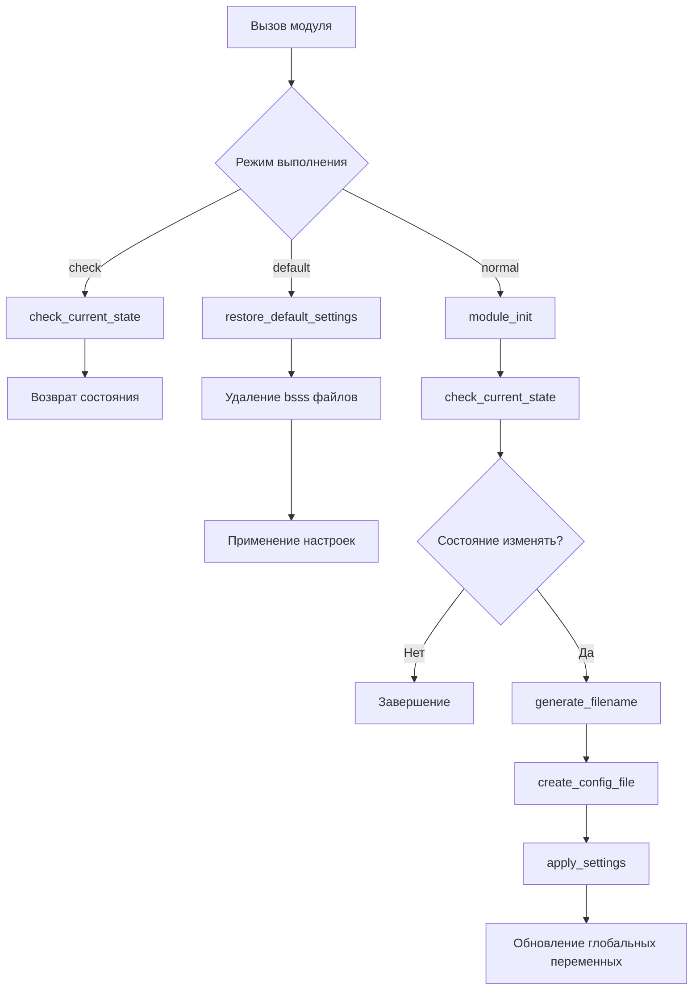
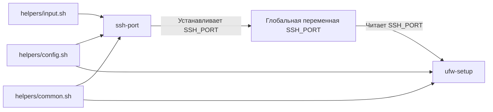
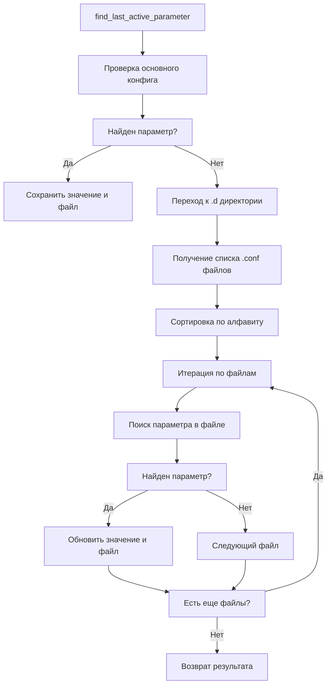

# Диаграмма архитектуры BSSS

## Общая архитектура



## Архитектура модуля



## Взаимодействие между модулями



## Поток данных при поиске конфигурации



## Архитектура тестирования

```mermaid
graph TD
    A[test-runner.sh] --> B[Выбор сценария]
    B --> C[setup_test_environment]
    C --> D[Создание mock окружения]
    D --> E[run_scenario_tests]
    E --> F[Запуск модулей в тестовом режиме]
    F --> G[Проверка результатов]
    G --> H[cleanup_test_environment]
    H --> I[Удаление mock окружения]
    I --> J{Есть еще сценарии?}
    J -->|Да| B
    J -->|Нет| K[Завершение тестов]